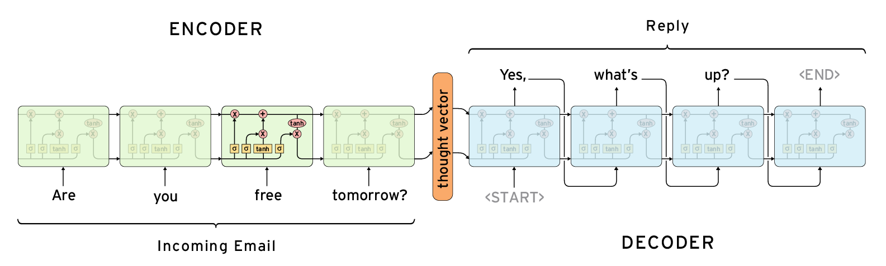

# seq2seq_tyf

## 输入与输出
---

输入与输出格式：一行为一句，每局词语之间用空格隔开

```
bios 设置 硬盘 为 第一 选项
人工 服务
如何 通过 微软 官网 下载 升级 工具 升级 Windows   10

```

## 模型
---

seq2seq模型如下，其中编码器为（bidRNN/RNN 二选一），解码为RNN。其中RNN采用LSTM实现


*Picture from [Deep Learning for Chatbots](http://www.wildml.com/2016/04/deep-learning-for-chatbots-part-1-introduction/)*


## 参考
---
* [ematvey/tensorflow-seq2seq-tutorials](https://github.com/ematvey/tensorflow-seq2seq-tutorials)
* [RNN-for-Joint-NLU](https://github.com/applenob/RNN-for-Joint-NLU)